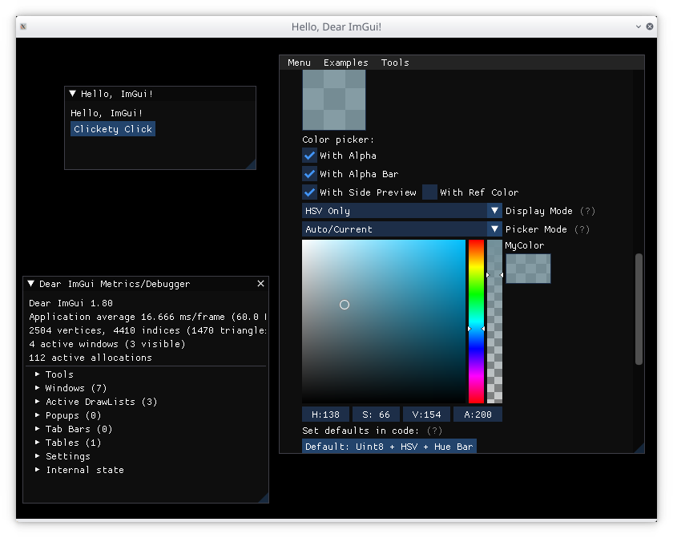

# Dear ImGui.hs

> Dear ImGui is a **bloat-free graphical user interface library for C++**. It
> outputs optimized vertex buffers that you can render anytime in your
> 3D-pipeline enabled application. It is fast, portable, renderer agnostic and
> self-contained (no external dependencies).

This project contains Haskell bindings to the
[ImGui](https://github.com/ocornut/imgui) project. This allows you to rapidly
put together graphical user interfaces in Haskell, with a particular focus to
games and graphics intensive applications.

# Getting Started

To get started, we'll build the following:



`dear-imgui.hs` can be used like a normal Haskell library. If you use Cabal,
simply add `dear-imgui` to your `build-depends`. ImGui supports a variety of
backends, and you will need to choose your backend at configuration time.
Backends can be enabled using Cabal flags, and these can be set through the
`cabal.project` file. For example, if you want to use a combination of SDL and
OpenGL:

```
package dear-imgui
  flags: +sdl +opengl3
```

With this done, the following module is the "Hello, World!" of ImGui:

``` haskell
{-# language BlockArguments #-}
{-# language LambdaCase #-}
{-# language OverloadedStrings #-}

module Main ( main ) where

import Control.Exception
import Control.Monad.IO.Class
import Control.Monad.Managed
import DearImGui
import DearImGui.OpenGL2
import DearImGui.SDL
import DearImGui.SDL.OpenGL
import Graphics.GL
import SDL

main :: IO ()
main = do
  -- Initialize SDL
  initializeAll

  runManaged do
    -- Create a window using SDL. As we're using OpenGL, we need to enable OpenGL too.
    w <- do
      let title = "Hello, Dear ImGui!"
      let config = defaultWindow { windowGraphicsContext = OpenGLContext defaultOpenGL }
      managed $ bracket (createWindow title config) destroyWindow

    -- Create an OpenGL context
    glContext <- managed $ bracket (glCreateContext w) glDeleteContext

    -- Create an ImGui context
    _ <- managed $ bracket createContext destroyContext

    -- Initialize ImGui's SDL2 backend
    _ <- managed_ $ bracket_ (sdl2InitForOpenGL w glContext) sdl2Shutdown

    -- Initialize ImGui's OpenGL backend
    _ <- managed_ $ bracket_ openGL2Init openGL2Shutdown

    liftIO $ mainLoop w


mainLoop :: Window -> IO ()
mainLoop w = do
  -- Process the event loop
  untilNothingM pollEventWithImGui

  -- Tell ImGui we're starting a new frame
  openGL2NewFrame
  sdl2NewFrame w
  newFrame

  -- Build the GUI
  bracket_ (begin "Hello, ImGui!") end do
    -- Add a text widget
    text "Hello, ImGui!"

    -- Add a button widget, and call 'putStrLn' when it's clicked
    button "Clickety Click" >>= \case
      False -> return ()
      True  -> putStrLn "Ow!"

  -- Show the ImGui demo window
  showDemoWindow

  -- Render
  glClear GL_COLOR_BUFFER_BIT

  render
  openGL2RenderDrawData =<< getDrawData

  glSwapWindow w

  mainLoop w

  where
    untilNothingM m = m >>= maybe (return ()) (\_ -> untilNothingM m)
```

# Hacking

If you would like to help `dear-imgui`, here's how you can get started.

The best path to development is using
[Nix](https://nixos.org/guides/install-nix.html). Once you have Nix installed
(either in your operating system, or by running NixOS), you can enter a
development shell:

```
$ nix-shell
```

You should now be in a `bash` shell where you can run `cabal build all`,
`cabal run readme`, etc.

If you experience any difficulties, please don't hesistate to raise an issue.

# Getting Help

Feel free to raise bugs, questions and feature requests on the GitHub issue
tracker.

We have a Matrix room at
[`#dear-imgui.hs:ocharles.org.uk`](https://matrix.to/#/#dear-imgui.hs:ocharles.org.uk).
