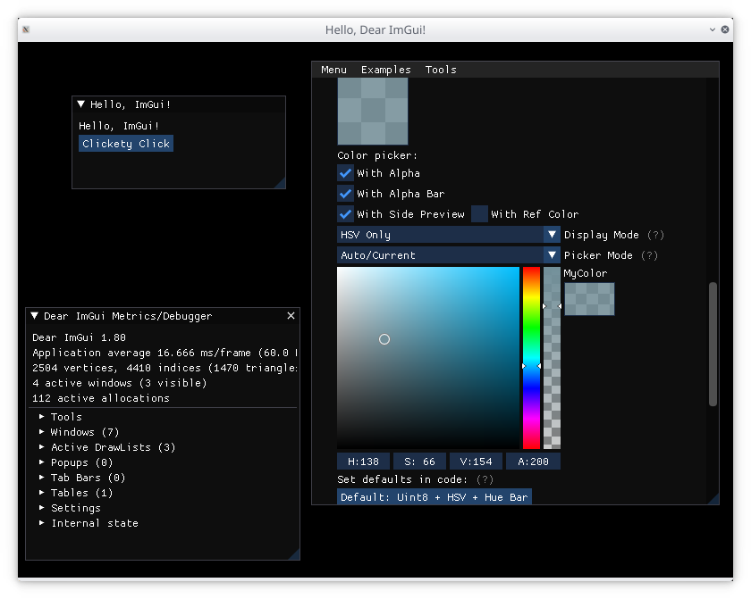

# Dear ImGui.hs

> Dear ImGui is a **bloat-free graphical user interface library for C++**. It
> outputs optimized vertex buffers that you can render anytime in your
> 3D-pipeline enabled application. It is fast, portable, renderer agnostic and
> self-contained (no external dependencies).

This project contains Haskell bindings to the
[ImGui](https://github.com/ocornut/imgui) project. This allows you to rapidly
put together graphical user interfaces in Haskell, with a particular focus to
games and graphics intensive applications.

# Getting Started

To get started, we'll build the following:



`dear-imgui.hs` can be used like a normal Haskell library. If you use Cabal,
add `dear-imgui` to your `build-depends`, together with the
`dear-imgui-impl-<backend>` package(s) for the platform and renderer backends
you want to use. For example, for a combination of SDL2 and OpenGL 3:

```
build-depends: dear-imgui, dear-imgui-impl-sdl2, dear-imgui-impl-opengl3
```

With this done, the following module is the "Hello, World!" of ImGui:

``` haskell
{-# language OverloadedStrings #-}

module Main ( main ) where

import DearImGui
import qualified DearImGui.Impl.OpenGL3 as ImplGL3
import qualified DearImGui.Impl.SDL2 as ImplSDL2

import Graphics.GL
import SDL

import Control.Monad.Managed
import Control.Monad.IO.Class ()
import Control.Monad (when, unless)
import Control.Exception (bracket)

main :: IO ()
main = do
  -- Initialize SDL
  initializeAll

  runManaged $ do
    -- Create a window using SDL; as we're using OpenGL, we enable OpenGL too
    window <- do
      let title = "Hello, Dear ImGui!"
      let config = defaultWindow { windowGraphicsContext = OpenGLContext defaultOpenGL }
      managed $ bracket (createWindow title config) destroyWindow

    -- Create an OpenGL context
    glContext <- managed $ bracket (glCreateContext window) glDeleteContext
    -- Create an ImGui context
    _ <- managed $ bracket createContext destroyContext

    -- Initialize ImGui's SDL2 backend
    managed_ $ ImplSDL2.withInitForOpenGL window glContext
    -- Initialize ImGui's OpenGL backend
    managed_ $ ImplGL3.withInit Nothing

    liftIO $ mainLoop window

mainLoop :: Window -> IO ()
mainLoop window = unlessQuit $ do
  -- Tell ImGui we're starting a new frame
  ImplGL3.newFrame
  ImplSDL2.newFrame
  newFrame

  -- Build the GUI
  withWindowOpen "Hello, ImGui!" $ do
    -- Add a text widget
    text "Hello, ImGui!"

    -- Add a button widget, and call 'putStrLn' when it's clicked
    button "Clickety Click" >>= \clicked ->
      when clicked $ putStrLn "Ow!"

  -- Show the ImGui demo window
  showDemoWindow

  -- Render
  glClear GL_COLOR_BUFFER_BIT
  render
  ImplGL3.renderDrawData =<< getDrawData

  glSwapWindow window
  mainLoop window
  where
  -- Process the event loop
  unlessQuit action = do
    shouldQuit <- gotQuitEvent
    unless shouldQuit action

  gotQuitEvent = do
    ev <- ImplSDL2.pollEvent

    case ev of
      Nothing ->
        return False
      Just event ->
        (isQuit event ||) <$> gotQuitEvent

  isQuit event =
    eventPayload event == QuitEvent
```

# Raw access

The high-level `DearImGui` module covers the common widgets. Everything else is
reachable through the generated [`dear-imgui-raw`](https://gitlab.com/dpwiz/hsimgui)
packages that `dear-imgui` is built on: one module per struct
(`DearImGui.Raw.ImGui`, `DearImGui.Raw.ImDrawList`, ...), plain `IO` functions
taking the full imgui argument list, and `OverloadedRecordDot` field accessors on
struct pointers (`poke io.iniFilename ptr`). Enum values live in per-enum
modules and are meant to be imported qualified:

``` haskell
import qualified DearImGui.Raw.Enums.ImGuiWindowFlags as ImGuiWindowFlags

flags = ImGuiWindowFlags.NoTitleBar .|. ImGuiWindowFlags.NoResize
```

Renderer/platform backends live in the `dear-imgui-impl-<backend>` packages.
Each one exposes a raw layer (`DearImGui.Raw.Impl.SDL2`,
`DearImGui.Raw.Impl.OpenGL3`, ...) working on raw pointers, plus a bridge
module (`DearImGui.Impl.SDL2`, `DearImGui.Impl.GLFW`, ...) that accepts the
`sdl2`/`GLFW-b` handle types, feeds SDL events to ImGui (`pollEvent`) and
provides `withInit*` brackets. For Vulkan, `DearImGui.Impl.Vulkan` covers the
descriptor pool and `ImGui_ImplVulkan_Init` boilerplate, for both render-pass
and dynamic-rendering targets.

# Hacking

If you would like to help `dear-imgui`, here's how you can get started.

The best path to development is using
[Nix](https://nixos.org/guides/install-nix.html). Once you have Nix installed
(either in your operating system, or by running NixOS), add the haskell.nix
binary caches to your `nix.conf` so you don't end up building GHC from source:

```
extra-substituters = https://cache.zw3rk.com https://cache.iog.io
extra-trusted-public-keys = loony-tools:pr9m4BkM/5/eSTZlkQyRt57Jz7OMBxNSUiMC4FkcNfk= hydra.iohk.io:f/Ea+s+dFdN+3Y/G+FDgSq+a5NEWhJGzdjvKNGv0/EQ=
```

Then you can enter a development shell:

```
$ nix-shell
```

You should now be in a `bash` shell where you can run `cabal build all`,
`cabal run readme`, etc.

If you experience any difficulties, please don't hesistate to raise an issue.

# Getting Help

Feel free to raise bugs, questions and feature requests on the GitHub issue
tracker.

We have a Matrix room at
[`#dear-imgui.hs:ocharles.org.uk`](https://matrix.to/#/#dear-imgui.hs:ocharles.org.uk).
